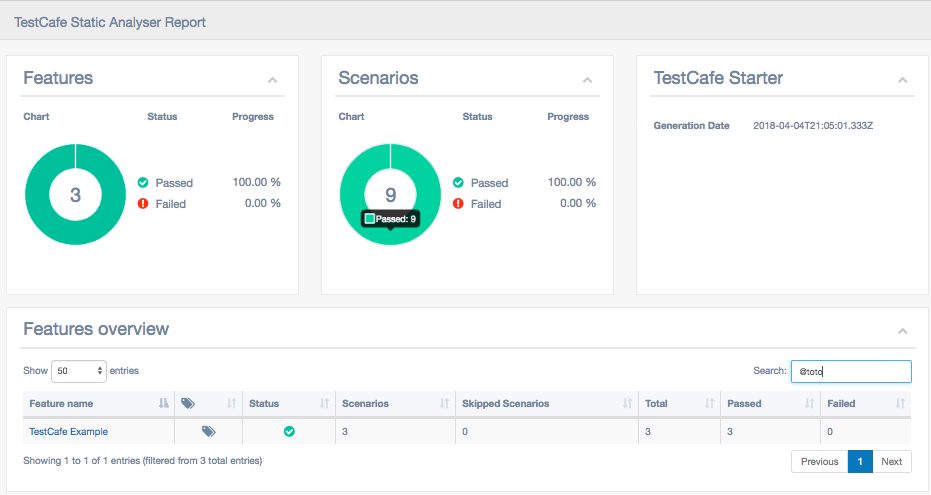

# TestCafe Static Analyser (beta)

## A tool to make a static analysis of your TestCafe tests and to generate a nice and searchable html report from it.

## To install TestCafe Static Analyser

* run the command `npm install --save-dev testcafe-static-analyser`.

## To configure TestCafe Static Analyser

* insert the following script in the `package.json` file:
```javascript
"testcafe-static-analyser": "testcafe-static-analyser"
```
* run the command `npm run testcafe-static-analyser`
    * this will create the `testcafe-static-analyser.json` file
    * in this file, modify the `sourceFiles` section

## How it works

* Every fixture is automatically tagged by analysing its folder hierarchy and its description;
* Every step is also automatically tagged by analysing its description;
* every tags generated at the step level are bubbled up to the fixture tags;
* The html report enables you to search/filter fixtures by tag.

## How it looks

* Fixtures are reported as Features and tests as Scenarios




## The vision

* Be able to have an high overview of all existing e2e TestCafe tests;
* Be able to tag at any level and find all tests associated to a specific tag;
* Be able to add the result of tests executions (need to write a custom testcafe reporter for this purpose);
* Be extensible to enable any third-party to add custom parsers and tags (without cloning the project);
* Be extensible to make html report customizable (without cloning the project).

## I Need your help and feedback. Feel free to contribute.